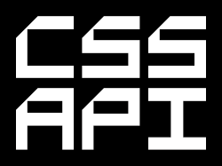

# CSSAPI

CSSAPI provides sites and apps using CSS-in-JS with a simple mechanism for defining, managing and accessing values used throughout their styles, improving consistency and flexibility.



[](https://www.npmjs.com/package/cssapi)
[](https://codecov.io/gh/Undistraction/cssapi)
[](https://travis-ci.org/Undistraction/cssapi)
[](./LICENSE.md)
[](https://nodesecurity.io/orgs/undistraction/projects930dbe2f-0b3a-4ab8-ab09-1f271a358da2)

In the last few years many of the problems inherent with CSS have been partially mitigated by adding a layer in between the declaration of the styles and the rendering of the styles. In the early days it was through esoteric preprocessor languages and today it is through CSS-in-JS. This library is my attempt to build on the current CSS-in-JS landscape and create the API for writing CSS that I've always wanted. I can honestly say that I've got pretty close to my happy place and even if you don't think this is for you, hopefully you'll find the approach interesting. It started out as a series of utility libraries but it quickly became clear a more integrated solution was necessary.

## Who Is This For?

If you use a CSS-in-JS solution and want to write less and more consistent CSS, then this library might be for you. I think will prove very useful even if it's just you working on a project, but across a team it has the potential for greatly improving consistency and work-flow. Apart from a powerful API, it gives you a place for a single source of truth, and that alone can be a great boon. It will be particularly useful if you are making heavy use of media queries and your styles change a lot across your breakpoints and should appeal if you you are fan of print-influenced layouts and consistent baseline grids. 

There are already some great libraries that do something similar, but I found them all lacking in one respect or another. There are a few important factors which guided my decisions in designing it:

* Setting styles on a component via its props is the answer. In fact it's an anti-pattern. The component api should be the boundry between *what* and *how*.
* Even if you are using an API on top of CSS, style names should be the ones you are already familiar with.
* Functionality should be flexible, customisable and easily extendible.
* Library should be useful even if only using a subset of features.
* Fully embrace the potential offered by functional JavaScript.

CSS isn't going to get any better any time soon, so this is my attempt at making it less painful to use. 

## What Does It Look Like?

Here is a simple example of using cssapi when defining a styled-component:

```javaScript
import { scope } from 'cssapi'
import api from '../../config/cssapi'

const Title = styled.h2`
  position: relative;
  text-align: center;
  ${api({
    font: `font:title`,
    padding: `20 40`,
    baseline: `scale:medium 3`,
    background: `image:paperTexture gradient:gentleFade`,
  })}
`
```

## Installation

```bash
yarn add cssapi
```

Or

```bash
npm install cssapi
```

## Overview

CSSAPI solves a number of problems:

- Provides a single place to define values which you want to use across your styles, meaning you can be sure they are used consistently – for example you can define common gradients or colours – and allows you to look up these values from within your styles in an intuitive way, with errors if you try and access a value that doesn't exist.

- Defines a new type of unit - rhythm units (`.ru`) which allow you to think about your application in units of rhythm rather than with explicit length values and provides a `baseline` helper for rendering text within a consistent vertical rhythm.

- Provides a terse syntax for defining values that change across your application's breakpoints and supports the automatic generation of media queries. This allows you to define a style in a single place and know its value will change across breakpoints in a predictable way.

There is an example you can edit live [here](https://stackblitz.com/edit/cssapi-example)

If you'd like to see it in use, take a look at [gatsby-skeleton-starter](https://github.com/Undistraction/gatsby-skeleton-starter) a starter for the poplar static site generator Gatsby which makes heavy use of styled-components and cssapi in styling its components. 

### Workflow

Here's a diagram showing how CSSAPI fits into the CSS-in-JS workflow. It is common for CSS-in-JS libraries to use mixin/utility functions to pull in values or groups of styles into the defined styles. When using CSSAPI you will use a function to pull in your values in the same way you would use a mixin/utility function. You can also use it from within mixins/utility functions when it makes sense.


In practical terms, this means 

1. Defining values in a configuration object.
2. Passing the configuration object to the `cssapi` function which will build your api and return your `api` function.
3. Use your `api` function from within your components to access your configured values. 

The `api` function is an object of styles, with the keys as camel-cased versions of the original CSS property, for example `paddingLeft` for `padding-left`. There are also a number of helpers like `paddingH` which will set `padding-left` and `padding-right`. Any valid CSS value can be passed as the value for that style and will be rendered, however by passing the values through the `api` function you get access to your configuration as well. 

### Breakpoints

When using traditional CSS we commonly use breakpoints to make changes to UI at different screen-widths. Although simple changes are easy - for example to collapse three columns to two or show a navigation menu, there is another type of change that is much harder to manage. We often want the spacing in our UI to increase uniformly, or our text to scale up in a sensible way. One option is to change the root font size at different breakpoints, but this is a clumsy and unintuitive approach, effecting everything on the page that uses a relative unit. 

CSSAPI allows you to abstract the *idea* of spacing or type-scales away from the *implementation* of the spacing or scales. This means you can describe your layout in terms of units of spacing ('rhythm units': `ru`) and named type-scales ('scale:large). Using configuration you can then define what these *mean* at different breakpoints and have the library render the implementation. 

This gives you complete control over changes in your UI. Whether you want the meaning of a value to change automatically across breakpoints, or whether you want to change the meaning at different breakpoints. For example you can choose whether a title should always have a `scale:large`, whatever that means at a breakpoint, or you can decide that it should change from a `scale:large` to a `scale:medium` at a given breakpoint.

### A Note On 'rhythm' And 'baseline'

This library uses a couple of important concepts taken from the world of print. The idea is that a consistent vertical rhythm is maintained through the page by ensuring that elements within a page fit within a consistent, repeated unit. You can think of this a little like a grid, only without the vertical lines, or a page of lined paper. This is what is known as a 'baseline grid':


When it comes to setting text to a baseline grid, the line-height is kept to a multiple of the baseline grid. You can think of it as always being rounded up to the next multiple of the baseline grid. Because this rounding up can result in lots of extra whitespace in cases where the text is only just bigger than a multiple of the baseline grid, you also have the option of rounding to the nearest half-line. 

This library uses the idea of rhythm in two ways - it allows you to set values in rhythm units (`.ru`) which can also be used for horizontal spacing, and it offers a `baseline` helper that will automatically calculate the number of lines of `line-height` needed for any given `font-size`. 

Here is an example of a div containing a header and some smaller text using the baseline grid. The box has a top and bottom margin of `3ru` and a right margin of `2ru`. The header has a `line-height` of `3ru` and the smaller text has a `line-height` of `1.5ru`.


You don't have to use either rhythm units or the `baseline` helper, but they will give you site-wide consistency of spacing and a single place to change that spacing. This technique is especially powerful when you need to change spacing at different breakpoints. By using the `scope` helper in tandem with scoped data values you can set a value to a rhythm unit and CSSAPI will render the necessary media queries to ensure that this is resolved to the correct value for the given breakpoint. For example it is common to increase font-size and spacing when moving above a smaller screen-size due to the increased real-estate and probably increased viewing distance. Using scopes you can tell CSSAPI that by default a rhythm unit is worth `1.5rem`, but above a breakpoint of 1000px, it is worth `2rem`. Similarly you can specify different values for your type-scale. Normally this would require you to write lots of media queries changing values thoughout your application. With CSSAPI you can set these values once and have the queries generated for you. 

### Validation

Throughout this library, validation is used where possible to generate useful errors if you supply invalid or incorrect values and any errors should include useful messages to help you understand what's gone wrong. If you receive unhelpful errors, please open an issue so I can make sure they are more useful.

### An Example

Here is an example to help you get a feel for the library along with an explanation of what is happening. Full docs follow the example.

#### Configuration

The first thing you need to do is create the `api` function and export it for use throughout your application. `cssapi` exports a default function, and calling it will return your `api` function.

```JavaScript
import cssapi from 'cssapi'

// Create your api function
const api = cssapi()

// Export the api function for use in your application
export default api
```

If you call `cssapi` with no arguments you will get the [default configuration](https://github.com/Undistraction/cssapi/blob/master/src/config/defaultConfig.js)). This configuration enables lots of functionality out of the box, but doesn't define any breakpoints.

Lets take a look at an example of a custom configuration:

```JavaScript
const api = cssapi({
  breakpoints: [
    [`smallUp`, 400],
    [`mediumUp`, 800],
    [`largeUp`, 1200],
  ],
  data: {
    rhythm: 24,
    baseline: {
      lineHeight: 24,
    },
    color: {
      red: `#EE0`,
      danger: `color:red`,
    },
    font: {
      shrikhand: `shrikhand`,
      helvetica: `helvetica`,
      title: `font:shrikhand Sans-Serif`,
      body: `font:helvetica Sans-Serif`,
    },
    scale: {
      body: 14,
      primary: 22,
    },
    scopes: {
      resolve: [`mediumUp`, `largeUp`],
      data: {
        rhythm: 28,
        baseline: {
          lineHeight: 28
        },
        scale: {
          body: 18,
          primary: 26,
        },
      }
    }
  }
})
```

A quick explanation to give you a sense of things

First up we define a series of breakpoints. Here we are using unitless numbers which will be interpreted as pixel values, but ultimately all breakpoints will be rendered using ems. Here as elsewhere, this library handles the conversion for you transparently. 

Next we define a data object. This object describes values we will use in our application. Values can be a simple key-value pair or an object. 

- `rhythm` is setting a unit to use throughout the application when defining things like padding or margin. Instead of using distance values, you can use rhythm units, for example setting padding to `2ru` would map to `3rem`. This lets you think about your layout in a more abstracted and consistent way. It also allows you to change the spacing of an entire application by tweaking a single value.

- `baseline` defines the baseline used for displaying text. Later you will see that you can use the `baseline` helper to generate a `line-height` appropriate for your chosen `font-size`. Here we set it to the same value as our `rhythm` value, ensuring type is locked to a baseline in mulitples of our rhythm unit.

- `color` declares a map of colour values. Although we do define explict hexidecimal colour values here, we also define mappings by using tokens. For obvious reasons it isn't good practice to refer to colours using such direct naming, so we abstract it through the use of a token. You will see how to use tokens later, but this token tells the library to replace the token with a lookup to 'color.red`. We do the same with our fonts and as you can see we define a font-stack, and the tokens within the string will be replaced by the font names we have defined. We then define a font-scale, again insulating our UI from the raw values by using a named scale.

- Finally we define a `scopes` object. This allows us to change values at any of the breakpoints we have defined, so here we are saying 'From medium up, increase both `rhythm` and `baseline` values to `28`. As you will see later, this allows the library to generate most media queries for you with minimum configuration. We also define a different font scale, scaling text up for larger screens.

#### Use

Once we have created an `api`, we can use it anywhere in a component by calling the `api` function with an object of declarations. A declaration is effectively just a CSS declaration, but made via our api, allowing us to do lots of things that wouldn't be possible using pure CSS. Note: here we are just importing the `api` function, but the library also supports access through a component's theme which you can read about [here](https://github.com/Undistraction/cssapi#using-themes))

```JavaScript
import { scope } from 'cssapi'
import api from '../../config/cssapi'

const Title = styled.h2`
  ${api({
    font: `font:title`,
    padding: {
      default: `1ru`,
      mediumUp: `2ru 1ru`,
    },
    baseline: scope`scale:primary`,
  })}
`
```

Here are the styles that will be returned:

```css
font-family: shrikhand Sans-Serif;
padding: 1.5625rem;
font-size: 1.375rem;
line-height: 1.5rem;

@media (min-width: 62.5em) {
  padding: 3.5rem 1.5rem;
  font-size: 1.625rem;
  line-height: 1.75rem;
}
```

In rendering these styles CSSAPI has done the following:

- all values have been converted to the default output unit of rems. 
- Our font stack has been rendered.
- The `baseline` helper has rendered both a `font-size` based on the scale we defined and a `line-height` based on a multiple of the value we configured for `baseline`.
- Our padding, which we described in `rhythm` units has been rendered using the `rhythm` units we defined. As well as a default value, we defined a scope targeting `mediumUp` and `largeUp` breakpoints which defined a different `rhythm` value to our default. Here we set different values in rhythm units, one for our default, and one targeted at `mediumUp`, so these values are used to generate the output value in rems.
- `font-size` has been rendered using the scale we defined, however crucially, we tagged it using `scope`. This tells the library that it should use the values you have supplied for scopes to automatically generate queries for each breakpoint. This means you can set a single value and be sure it will be rendered across all your breakpoints _using the value appropriate for that breakpoint_. Rendering is clever enough to only render the minimum breakpoints necessary to achieve your intent. In this instance it can see that the `rhythm` unit changes once at the `mediumUp` breakpoint, so it adds the appropriate value within the appropriate media query.

---

## Full Docs

### Configuration

#### `createApi`

To start working with this library you need to create an api function. The function takes an object as its single argument. This object does a few important things:

- Describes your application's breakpoints
- Describes settings for use in creating CSS
- Describes simple or complex values to use in creating CSS
- Describes the kinds of transformations you want to perform on CSS values
- Configures aliases for token values used in your CSS declarations

You can see the default configuration in `src/config/defaultConfig.js`. Any configuration you supply will be merged with the default configuration.

You create the api function as follows: 

```JavaScript
import configureCSSAPI from 'cssapi'

const config = {
  …
}

const api = cssapi(configuration)
```

The config object is broken into three sections:

##### 1. Breakpoints

Breakpoints should be supplied as an array of arrays. Each array item should include two values:

- The name of the breakpoint
- The value of the breakpoint:

```JavaScript
const breakpoints = [
  [`smallUp`, `25em`],
  [`mediumUp`, `50em`],
  [`largeUp`, `75em`],
]

const config = {
  breakpoints,
}

```

The value can either be a unitless number (which will be interpreted as a value in pixels), or an em value as a string (for example `60em`). Whichever you choose, media queries will ultimately be rendered using ems. Breakpoint order is important and values should run from low to high. There is no limit on the number of breakpoints you want to use, but as you'll see later, there is a mechanism for creating relative breakpoints (basically *tweakpoints*), so these breakpoints should represent the primary breaks in your application. The fewer the better. You should not define a `default` breakpoint. This will be handled automatically.

##### 2. Data

Data supplies values that will be used in transforming CSS values and each piece of data will be used by one or more transformers. Values at the root are treated as default values, however you can add values that are specific to one or more breakpoints using nested `scopes`.

###### Layout Settings

`lengthUnit` defines what unit will be used for outputting length values. The default is `rem` units, but you can change this to `px` or `em`.

`baseFontSize` should be set to the root-most font size of your application. By default browsers will have a root font size of `16`. If you change it for any reason you will need to change it here as well, so that calculations converting `px` values to `rem` values produce the expected results.

`rhythm` defines a special unit for use throughout your application. When you supply values to the api function, you can use `ru` units which will resolve to multiples of this value. You can use these units to abstract your thinking about spacing within the application, allowing you to think in rhythm units rather than explicit distance values. This also means you have control over your application's whitespace from a single location.

`baseline` provides you with a set of three configuration options which will control how the `baseline` helper will work. The idea behind the use of a baseline is that the `line-height` of text is always set to multiples of fixed baseline unit to ensure a consistent vertical rhythm. In almost all cases you will want the `baseline` value to be the same as the `rhythm` value.

- `lineHeight` defines the height of a single line.
- `minLeading` defines the minimum difference between `font-size` and the `line-height` before the space is considered too tight and a new line is added.
- `allowHalfLines` toggles whether whole or half-lines should be used when deciding on the number of lines needed to accommodate text. Setting this to `true` (the default), is more forgiving in cases where a `font-size` is only marginally larger than `line-height` because only half a line of additional whitespace is added. 

###### Maps

Maps store values that you want to access from within your application. When you are defining styles, you will use tokens to describe lookups, for example to get a colour you would use a token that looks like this: `color:primary`. Each map also supports aliases, for example `color` has an alias of `c` so you can use `c:primary`. By default the library supports the following maps:

- `color`, (alias of `c`)
- `gradient`, (alias of `g`),
- `scale`, (alias of `s`),
- `boxShadow`, (alias of `d`),
- `border`, (alias of `b`),
- `image`, (alias of `i`),
- `font`, (alias of `f`)

There is no enforcement of what values you place in these maps.

You can use tokens within the maps themselves to refer to other values within the same map or within different maps. For example, here we define a `color` and `gradient` map:

```JavaScript
const config = {
  data: {
    color: {
      red: `#FD0000`,
      darkRed: `#931111`,
      danger: `color:red`,
      dangerDark: `color:darkRed`
    },
    gradient: {
      warning: `linear-gradient(color:danger, color:dangerDark)`
    }
  }
}
```

It is easy to add further maps if you find there are other types of values you want to include. 

###### Scopes

Scope is one of the most powerful features in the library. It allows you declare values that change at a given breakpoint. As you will see later, when combined with breakpoint generation, this can automate a lot of your style declarations. You absolutely do not have to use scopes, but you'll find can make your CSS much more declarative amd greatly reduce repetition.

You can declare data values again within a new scope. Each scope consists of an object with two keys:

- `resolve` is an array of breakpoint names
- `data` is a map of data values

In the following example we declare a default `rhythm` value of `20`, then two scopes. One to cover the breakpoints `smallUp` and `mediumUp`, and another to cover `largeUp`. When we ask the library to resolve a value for a particular breakpoint, it will use the appropriately scoped value. 

```JavaScript
const config = {
  data: {
    rhythm: 20,
    scopes: [
      {
        resolve: [`smallUp`, `mediumUp`],
        data: {
          rhythm: 24,
        },
      },
      {
        resolve: [`largeUp`],
        data: {
          rhythm: 28,
        },
      },
    ],
  }
}
```

###### Aliases

As outlined above, you can define a map of aliases. The default configuration defines them as follows:

```JavaScript
const config = {
  data: {
    aliases: {
      c: `color`,
      g: `gradient`,
      s: `scale`,
      d: `boxShadow`,
      b: `border`,
      i: `image`,
      f: `font`,
    },
  }
}
```

##### 3.Properties

Properties define how each css property should be transformed and add new helpers that are available alongside the standard CSS properties. You don't need to do anything here to use the library, but you can override any of the properties defined here or add your own transformers or helpers to change the API available to you. See the section on using your own transformers for more information.

### API

The api is a simple one, consisting of a hand-full of functions:

#### `api()` 

The `api` function itself is the workhorse of this library. It accepts a single argument which must be a map of declarations. The library will process these declarations and return the rendered CSS, generating media queries and intelligently batching declarations to reduce the number of generated styles. The API supports most commonly used CSS properties and the default config defines how values supplied to these properties should be transformed. 

You can supply any valid css value to these declarations. The value(s) will be run through a series of transformations which will decide if they need to transform the value or not. If the value isn't matched by any transformers it will be passed through untouched, however if the transformer detects a value that it knows how to transform, it will transform that value and replace it with the result of the transformation.

##### Transformers

You don't need to worry about configuring transformers as the default config does this for you, but the effect of the transformers are:

- For values in any declaration that support a CSS Length value you can supply a unitless value (in pixels) and it will be transformed into your chosen output value (defaults to `rem`). If you supply a value using `ru` units, for example `2.5ru` the value will be converted to a mulitple of the rhythm unit you supplied in the configuration (or the default).

- You can use tokens in property values and they will be looked up in your configuration's data maps, for example a value of `color:primary` will be replaced with the value stored in the `primary` key of your `color` map. 

`calc` is supported and values within will be parsed. There are also transformers in place for dealing with gradients, transforms and urls, and values declared within all will be parsed and transformed, for example `translate(400, 50%)` will be transformed into `translate(25rem, 50%)`.

##### Important note

You should only use the `api` function for values that need to be transformed. Any values that don't need to be looked up, transformed or wrapped in a query should be declared as usual. This minimises the performance overhead of using the function at runtime. The fewer styled that need to be parsed by `api` the better. 

##### Basic Values

Here is an example of passing in rhythm units:

```JavaScript
api({
  padding: `1ru`,
  margin: `2ru 1ru`
})
```

```css
padding: 1.25rem;
margin: 2.5rem 1.25rem
```

If we pass in a token, it will be transformed into the value stored in the relevant map defined in your config:

```JavaScript
api({
  color: `color:primary`,
  background: `gradient:smoothFade, image:paperTexture`,
})
```

```css
color: #F0AA12;
background: linear-gradient(#AAA, #FFAAB1), url('example.png')
```

##### Breakpoints

One of the biggest advantages of using this library is its handling of breakpoints. If you want the values of a property to change across breakpoints, you have a number of options.

###### Array

If we pass in an Array, those values will be used for consecutive breakpoints, starting with the default. Note that with array values, each media query targets the range for that breakpoint except for the last value which will target the range from that breakpoint and up. This library will ensure the correct values are used, and that breakpoint ranges are separated using a `0.001em` gap:

```JavaScript
api({
  padding: [`1ru`, `1ru 2ru`, `3ru ]
})
```

```css
@media (max-width: 24.99em) {
  padding: 1.25rem;
}

@media (min-width: 25em) and (max-width 49.99em) {
  padding: 1.25rem 2.5rem;
}

@media (min-width: 50em) {
  padding: 3.75rem;
}
```

###### Object

If we pass in an object instead of an array, we can select values for one or more breakpoints:

```JavaScript
api({
  padding: {
    default: `1ru`,
    mediumUp: `2ru`,
  }
})
```

```css
padding: 1.25rem;

@media (min-width: 50em) {
  padding: 2.5rem;
}
```

If we supply a breakpoint name only, the query generated will target everything above that breakpoint, however there is much more that we can do here by using modifiers and offsets to hone in on a more specific range. 

To target just the range between the named breakpoint and the next breakpoint we can use an `@` modifier:

```JavaScript
api({
  padding: {
    [`@mediumUp`]: `1ru`,
  }
})
```

```css
@media (min-width: 50em) and (max-width: 74.99em) {
  padding: 1.25rem;
}
```

To generate a query targeting everything below a breakpoint:

```JavaScript
api({
  padding: {
    [`<mediumUp`]: `1ru`,
  }
})
```

```css
@media (max-width: 49.99em) {
  padding: 1.25rem;
}
```

To generate a query targeting everything above a breakpoint:

```JavaScript
api({
  padding: {
    [`>mediumUp`]: `1ru`,
  }
})
```

```css
@media (min-width: 50em) {
  padding: 1.25rem;
}
```

Note: this is the default behaviour, but the `>` is supported for consistency.

To generate a query targeting everything between two breakpoints:

```JavaScript
api({
  padding: {
    [`smallUp<largeUp`]: `1ru`,
  }
})
```

```css
@media (min-width: 25em) and (max-width: 49.99em) {
  padding: 1.25rem;
}
```


You can also use offsets by using `+` or `-` with a value (in pixels). This will offset the breakpoint value by the supplied amount, so the following would target everything above `mediumUp` + `100px` which is `(400 + 100) / 16`.

```JavaScript
api({
  padding: {
    [`>smallUp+100`]: `1ru`,
  }
})
```

```css
@media (min-width: 56.25em) {
  padding: 1.25rem;
}
```

Values below zero will not raise an error, but will be clamped to zero. 

When the library processes breakpoints it batches them automatically and condenses sibling breakpoints with the same values into a single breakpoint. 

##### Scopes

Scopes are a very powerful feature and allow you to set a value across all breakpoints with the appropriate value pulled from your configuration's scopes. 

All values at the root of your config's `data` object are resolved as default values. If you don't define any scopes they will be used no matter which breakpoint is being resolved. For example if we set `rhythm` to `1.5rem` this will remain constant throughout. However, using scopes, we can tell CSSAPI that the meaning of a value changes across a breakpoint range. 

The library offers a special helper for dealing with cases where you want to define a property once and have it automatically scoped across all your breakpoints. CSSAPI will resolve the meaning of a value for all breakpoints and render the necessary media query to ensure that value changes as needed. In the following example we have set a different `rhythm` value of `28` in our config scoped to breakpoints `mediumUp` and `largeUp`:

```JavaScript
import { scope } from 'cssapi'

api({
  padding: scope`1ru`,
})
```

```css
@media (max-width: 49.99em) {
  padding: 1.25rem
}
@media(min-width: 50em) {
  padding: 1.75rem;
}
```

As you can see, this allows you to completely decouple your declaration of a value from the implementation of breakpoints to render that value. You can think about what a value *means* rather than what it *is*.

Note: If you are targeting a range that spans more than one scope, the value from the lowest scope will be used. In such cases it is your responsibility to use separate ranges to cover different scopes.

#### mq()

The `api` function has two functions available as properties on itself. The first is `mq` which allows you to declare breakpoints in a more traditional way. Values supplied will be resolved using any scopes defined for that breakpoint or range of breakpoints and rendered with the appropriate query. `mq` does not support values defined as arrays or objects as they make no sense in this context.

```JavaScript
api.mq('smallUp', {
  padding: `1ru`
})
```

Modifiers and offsets can be used here as well:

```JavaScript
api.mq('>smallUp+100', {
  padding: `1ru`
})
```

#### extend()

`extend` can be used to create a new api function based on a previous api function, but including any new values you supply which will overwrite any values that were already defined. The original api function will be untouched. As you will see later, this is useful for defining theme-specific apis. 

```JavaScript

const api = createApi({
  rhythm: 22,
})

const newApi = api.extend({
  rhythm: 26,
})
```

### CSS Props and Helpers 

#### Props

There are too many props to list here, but most CSS you use in your day-to-day work should be covered. Take a look at the [default configuration](https://github.com/Undistraction/cssapi/blob/master/src/config/defaultConfig.js) to see all the properties that are supported. If you find a property that isn't, please create an issue or a PR adding it. 

#### Helpers

As well as the standard CSS properties supported, the following helpers are also available. They are mostly self explanatory and will work with varying numbers of arguments if it makes sense, for example `paddingH` supports a single value (which will be rendered as `paddingRight` and `paddingLeft`) or two values, one of which will be rendered to each. 

- *baseline* This is discussed earlier, setting `font-size` and `line-height`
- *paddingH* 
- *paddingV*
- *marginH*
- *marginV*
- *borderH*
- *borderV*
- *offset* This is a shorthand for setting `top`, `right`, `bottom`, `left`
- *offsetV* This is a shorthand for setting `top`, `bottom`
- *offsetH* This is a shorthand for setting `right`, `left`
- *borderTopRadius* 
- *borderRightRadius*
- *borderBottomRadius*
- *borderLeftRadius*

### Using Themes

When using `styled-components` I've found it useful to make the API function available to my components via a theme. The library offers `api` and `mq` helpers to make that easier. Assuming we have added an api function to a theme and supplied it to a component via a `ThemeProvider`:

```JavaScript 
const api = createApi(config)

const theme = {
  api,
}

const Layout = ({ children, data }) => (
<ThemeProvider theme={theme}>
  <Site />>
</ThemeProvider>
)
```

#### api()

We can use the `api` function to access our api from within interpolations:

```JavaScript
import { api } from 'cssapi'

const Example = styled.div`
  ${api({
    padding: `1ru`,
  })}
`
```

Without this helper accessing the `api` function would be much more verbose:

```JavaScript
const Example = styled.div`
  ${props => props.theme.api({
    padding: `1ru`,
  })}
`
```

#### mq()

Similarly we can use the `mq` function to access our api's `mq` function:

```JavaScript
import { mq } from 'cssapi'

const Example = styled.div`
  ${mq(`mediumUp`, {
    padding: `1ru`,
  })}
`
```

### Using your own transformers

You can use the configuration to declare your own transformers for any of the default css properties and helpers, or add further css properties or your own helpers. To add a new property, just add a key to the config object's `properties` object. The value must be either a single transformer or an array of transformers. 

A transformer comprises of a predicate used to decide whether the transformer should be applied to a value, and a function that performs the transformation. If an array of transformers are supplied, the value will be run through each in the order they are are supplied, this allows a value to pass through multiple transformations. Take a look at the `src/transformers` directory for examples. 

Here is an example of the transformer that converts rhythm units to rems:

```JavaScript
const rhythmUnitsToRemsTransformer = transformer(
  isRhythmUnit,
  (value, data, breakpointName) => {
    const rhythm = resolveKeyToValue(`rhythm`)(value, data, breakpointName)
    return mulitplyUnitlessNumbersToDistance(
      rhythm,
      data.baseFontSize,
      LENGTH_UNITS.REM
    )(value)
  }
)
```

It uses the `transformer` helper which takes two arguments. The first is a predicate that checks the value to see if it is a rhythm unit - in this case it uses a RegExp to look for a numeric value followed by 'ru'. The second is the transformation function which first pulls in the `rhythm` value from the config, then uses a helper to perform a multiplication between the rhythm unit and the numeric portion of the rhythm value, outputting the resulting value in rems.


TODO: More docs about adding transformers. 

## Roadmap

* Add more helpers: namely improve definition and use of fonts.
* Performance: look at improving performance through memoising calls to the API.

## Maintainance

### Tests

Tests are written with Jest:

```bash
yarn test
```

### Publish to NPM

```bash
yarn publish:patch
yarn publish:minor
yarn publish:major
```
